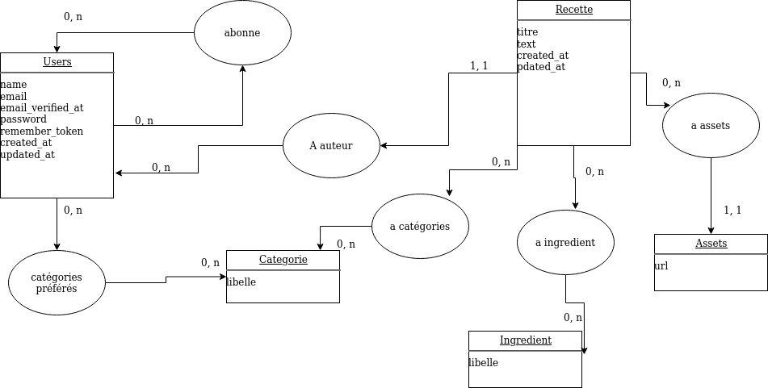
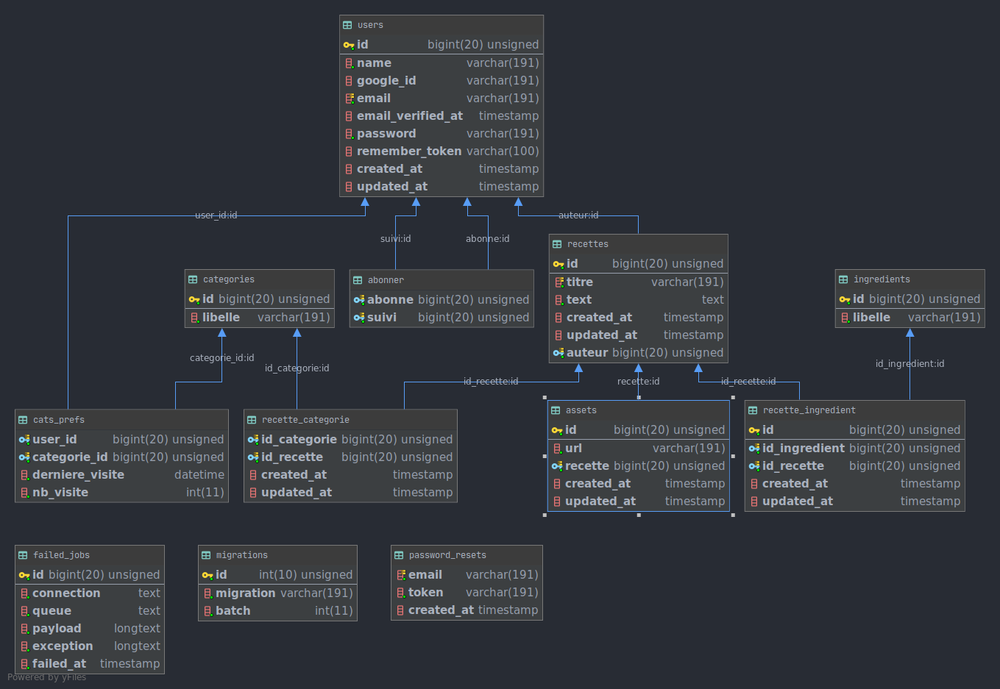

# Rapport Laravel sur Cassrollton

Cassrollton est un site reprenant les bases d'un site standard de cuisine comme Marmiton
en utilisant le framework Laravel.

|Fonctionnalités | Resultat|
|----------------|:-------:|
|créer un compte | ok |
|se connecter avec Google | non |
|se connecter | ok |
|se déconnecter | ok |
|créer une recette | ok |
|modifier une recette | ok |
|supprimer une recette | ok |
|noter une recette | ok |
|commenter une recette | ok |
|ajouter des ingrédients | ok |
|ajouter / enlever des ingrédients à une recette | ok |
|ajouter / enlever des catégories à une recette | ok |
|ajouter / enlever des images à une recette | ok |
|modifier le mot de passe | ok |
|suivre un auteur | ok |
|rechercher une recette en fonction de ses catégories | ok|
|rechercher une recette en fonction de son titre | ok| 
|formulaire de contact | ok |
|compteur de visite | ok |

## MCD : 

## MLD : 

## Problèmes rencontrés :
- Il nous a été impossible d'utiliser Dusk car il détruisait à chaque fois sa base de donnée et 
n'effectuait pas de migration dans un environnement vide.
- Nous avons essayé de déployer l'application mais la configuration nginx du site de laravel n'a pas fonctionné,
- Difficultés à appréhender un framework full stack alors que nous avons l'habitude d'utiliser un framework pour 
le Back-End et un autre pour le Front-End. 

## Pistes pour continuer le projet :
- Gestion de roles pour qu'un administrateur puisse pouvoir controller toutes les recettes
- Paginations avec les listes de recettes pour éviter la surcharge d'informations
- pouvoir supprimer des assets d'une recette et du stockage

